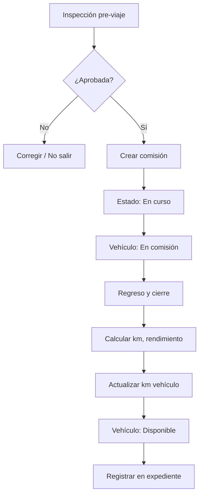
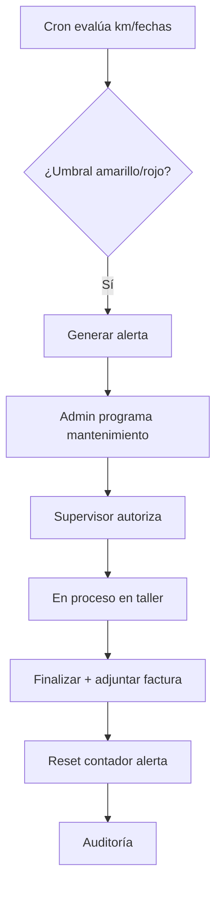

# FASE 1 — Análisis Funcional Completo
## Sistema Integral de Control Vehicular — CECYTE BCS

| Campo | Valor |
|-------|-------|
| **Versión del documento** | 1.0.0 |
| **Fecha** | 15 de junio de 2026 |
| **Estado** | Pendiente de aprobación |
| **Alcance de esta fase** | Análisis funcional exclusivamente (sin código ni BD) |

---

## 1. Resumen ejecutivo

El **Sistema Integral de Control Vehicular (SICV)** es una aplicación web empresarial orientada a la gestión del parque vehicular institucional de CECYTE BCS. Centraliza el ciclo de vida de cada unidad — desde su alta operativa hasta su baja — integrando comisiones, inspecciones, daños, mantenimiento, combustible, documentación, inventario de herramientas, alertas predictivas, reportes ejecutivos y auditoría completa.

La solución se desarrollará en **PHP 8.3 puro** con arquitectura **MVC**, patrones **Repository**, **Service**, **Middleware**, **Singleton** y **Factory**, cumpliendo **SOLID**, **Clean Architecture** y **Separation of Concerns**. No utilizará frameworks PHP.

Este documento define el **qué** y el **por qué** del sistema. Las fases posteriores traducirán estos requerimientos en modelo de datos, arquitectura técnica e implementación modular.

---

## 2. Contexto institucional

### 2.1 Problema actual (supuesto operativo)

| Área | Situación típica | Impacto |
|------|------------------|---------|
| Inventario vehicular | Registros dispersos (Excel, papel) | Duplicidad, datos desactualizados |
| Comisiones | Formatos manuales sin trazabilidad | Imposibilidad de auditar uso real |
| Mantenimiento | Sin historial centralizado | Costos ocultos, fallas recurrentes |
| Documentación | Vencimientos no monitoreados | Riesgo legal y operativo |
| Combustible | Cálculos manuales | Desviaciones de rendimiento no detectadas |
| Responsabilidad | Sin expediente digital único | Pérdida de contexto por cambio de personal |

### 2.2 Objetivos del sistema

1. **Trazabilidad total** de cada vehículo mediante expediente digital unificado.
2. **Control operativo** de comisiones, inspecciones y daños con evidencia fotográfica y firmas.
3. **Gestión financiera** de costos (mantenimiento, combustible, documentos) con indicadores.
4. **Prevención proactiva** mediante alertas automáticas con semáforo verde/amarillo/rojo.
5. **Gobernanza** mediante roles, permisos granulares y auditoría de acciones críticas.
6. **Toma de decisiones** mediante dashboard ejecutivo y reportes exportables (PDF, Excel, CSV).

### 2.3 Alcance

**Incluido:**
- Gestión de usuarios, autenticación y autorización.
- CRUD y consultas de todos los módulos descritos en el prompt maestro.
- Expediente digital por vehículo.
- Alertas automáticas configurables.
- Dashboard, reportes y auditoría.
- Interfaz ERP moderna (sidebar, modo oscuro, responsive, búsqueda global).

**Excluido (v1.0):**
- Integración con GPS/telemática en tiempo real.
- App móvil nativa (la UI será responsive web).
- Facturación electrónica CFDI completa (se almacenan XML/PDF adjuntos; no emisión).
- Integración con sistemas ERP externos (SAP, etc.) — preparado para extensión futura vía API.

---

## 3. Actores y roles

### 3.1 Actores del sistema

| Actor | Descripción |
|-------|-------------|
| Administrador General | Control total del sistema, usuarios, configuración y auditoría |
| Administrador de Transporte | Gestión operativa del parque, comisiones, mantenimiento y documentos |
| Supervisor | Supervisión, autorización de procesos y consulta ampliada |
| Responsable de Vehículo | Operación diaria de unidades asignadas (comisiones, inspecciones, reportes de daño) |
| Consulta | Solo lectura en módulos autorizados |

### 3.2 Matriz de permisos (resumen funcional)

Leyenda: **C** Crear | **R** Leer | **U** Actualizar | **D** Eliminar | **A** Autorizar | **X** Exportar

| Módulo | Admin General | Admin Transporte | Supervisor | Resp. Vehículo | Consulta |
|--------|:-------------:|:----------------:|:----------:|:--------------:|:--------:|
| Usuarios y roles | CRUD | — | R | — | — |
| Vehículos | CRUD | CRUD | RU | RU* | R |
| Expediente digital | R | R | R | R* | R |
| Comisiones | CRUD | CRUD | RUA | CRU* | R |
| Bitácora inspección | CRUD | CRUD | R | CRU* | R |
| Control de daños | CRUD | CRUD | RU | CRU* | R |
| Mantenimiento | CRUD | CRUD | RUA | R* | R |
| Combustible | CRUD | CRUD | R | CRU* | R |
| Inventario herramientas | CRUD | CRUD | R | RU* | R |
| Documentación | CRUD | CRUD | R | R* | R |
| Alertas | CRUD config | CRUD config | R | R | R |
| Dashboard | R | R | R | R* | R |
| Reportes | X | X | X | X* | X* |
| Auditoría | R | R** | — | — | — |

`*` Limitado a registros/vehículos asignados al usuario.  
`**` Admin Transporte: auditoría operativa, no de usuarios del sistema.

> **Regla de negocio:** Todo permiso se valida en **Middleware** antes de ejecutar el controlador. Permisos se almacenan de forma normalizada (rol → permiso → módulo/acción).

---

## 4. Requerimientos no funcionales

| Categoría | Requerimiento |
|-----------|---------------|
| **Seguridad** | `password_hash`/`password_verify`, CSRF, regeneración de sesión, bloqueo por intentos, HTTPS en producción |
| **Rendimiento** | Consultas indexadas; paginación server-side; carga de listados < 2 s con 500+ registros |
| **Disponibilidad** | Objetivo 99% en horario laboral institucional |
| **Escalabilidad** | Arquitectura modular; servicios desacoplados de controladores |
| **Mantenibilidad** | PSR-4 autoload, `declare(strict_types=1)`, sin SQL en vistas |
| **Usabilidad** | ERP moderno; máximo 3 clics para acciones frecuentes; feedback visual inmediato |
| **Auditoría** | Toda acción CRUD crítica registrada con before/after |
| **Respaldo** | BD y `/storage/uploads` incluidos en política de backup institucional |
| **Compatibilidad** | Chrome, Edge, Firefox (últimas 2 versiones); responsive tablet/móvil |

---

## 5. Módulos funcionales — Especificación detallada

---

### 5.1 Sistema de autenticación y sesiones

#### 5.1.1 Casos de uso

| ID | Caso de uso | Actor |
|----|-------------|-------|
| AUTH-01 | Iniciar sesión con email/usuario y contraseña | Todos |
| AUTH-02 | Cerrar sesión | Todos |
| AUTH-03 | Recuperar contraseña vía enlace temporal | Todos |
| AUTH-04 | Cambiar contraseña (logueado) | Todos |
| AUTH-05 | Recordar sesión (cookie segura) | Todos |
| AUTH-06 | Ver sesiones activas y revocar | Admin General |
| AUTH-07 | Consultar historial de accesos | Admin General |

#### 5.1.2 Reglas de negocio

1. Contraseña mínima: 8 caracteres, al menos 1 mayúscula, 1 minúscula, 1 número.
2. Tras **5 intentos fallidos** en 15 minutos: bloqueo temporal de cuenta (30 min) o desbloqueo manual por Admin.
3. `session_regenerate_id(true)` en login exitoso.
4. Token CSRF obligatorio en todos los formularios POST/PUT/DELETE.
5. "Recordarme": token aleatorio hasheado en BD + cookie HttpOnly, Secure, SameSite=Strict.
6. Sesión expira por inactividad (configurable, default 120 min).
7. Cierre de sesión invalida token de "recordarme" y destruye sesión server-side.

#### 5.1.3 Datos registrados por acceso

- Usuario, fecha/hora, IP, user-agent, resultado (éxito/fallo), motivo de fallo.

#### 5.1.4 Flujo — Login

```
[Usuario] → Formulario login + CSRF
    → Validación credenciales
    → ¿Bloqueado? → Mensaje + fin
    → ¿Válido? → Regenerar sesión → Registrar acceso → Redirigir Dashboard
    → ¿Inválido? → Incrementar intentos → Registrar fallo
```

---

### 5.2 Módulo de vehículos

#### 5.2.1 Entidad principal — Atributos

| Campo | Tipo lógico | Obligatorio | Validación |
|-------|-------------|:-----------:|------------|
| número_económico | string | Sí | Único institucional |
| marca | string | Sí | Catálogo o texto |
| modelo | string | Sí | — |
| versión | string | No | — |
| año | int | Sí | 1980–año actual+1 |
| color | string | Sí | — |
| placas | string | Sí | Único |
| serie_vin | string | Sí | 17 caracteres, único |
| motor | string | No | — |
| tipo_combustible | enum | Sí | Gasolina, Diesel, Híbrido, Eléctrico, GNC |
| capacidad_tanque | decimal | Sí | > 0 litros |
| kilometraje_actual | int | Sí | ≥ 0, no decrece excepto corrección auditada |
| área_asignada | FK área | Sí | Catálogo institucional |
| responsable_id | FK usuario | Sí | Rol compatible |
| fecha_adquisición | date | Sí | ≤ hoy |
| estado | enum | Sí | Ver catálogo estados |
| observaciones | text | No | — |
| foto_principal | file | No | JPG/PNG, max 5MB |
| galería | files[] | No | Múltiples imágenes |

#### 5.2.2 Estados del vehículo

| Estado | Descripción | ¿Disponible para comisión? |
|--------|-------------|:--------------------------:|
| Activo | En operación normal | Sí |
| Disponible | Listo para asignación | Sí |
| En comisión | Actualmente en viaje | No |
| En mantenimiento | Mantenimiento programado | No |
| En taller | Fuera por reparación | No |
| Fuera de servicio | Temporalmente inoperante | No |
| Baja | Dado de baja definitiva | No |

#### 5.2.3 Reglas de negocio

1. No se puede eliminar físicamente un vehículo con historial; solo transición a **Baja** (soft delete lógico).
2. Cambio de kilometraje en comisiones/mantenimiento/combustible actualiza `kilometraje_actual` si el valor es mayor.
3. Vehículo en **En comisión** no puede iniciar otra comisión simultánea.
4. Foto principal: una activa; galería ilimitada con límite de almacenamiento configurable.

#### 5.2.4 Casos de uso

| ID | Descripción |
|----|-------------|
| VEH-01 | Registrar vehículo nuevo |
| VEH-02 | Editar datos generales |
| VEH-03 | Cambiar estado con motivo obligatorio |
| VEH-04 | Asignar/reasignar responsable y área |
| VEH-05 | Gestionar galería fotográfica |
| VEH-06 | Consultar listado con filtros avanzados |
| VEH-07 | Ver expediente digital (vista 360°) |

---

### 5.3 Expediente digital del vehículo

Vista única consolidada — **hub central** del sistema.

#### 5.3.1 Secciones del expediente

| Sección | Contenido | Fuente de datos |
|---------|-----------|-----------------|
| Información general | Datos maestros + foto | `vehiculos` |
| Historial comisiones | Tabla cronológica + KPIs viaje | `comisiones` |
| Historial mantenimiento | Preventivo/correctivo/predictivo | `mantenimientos` |
| Historial combustible | Cargas y rendimiento | `combustible_cargas` |
| Historial daños | Registro y seguimiento | `danios` |
| Historial inspecciones | Bitácoras con semáforo por ítem | `inspecciones` |
| Facturas | Documentos vinculados | `documentos` |
| Documentación | Pólizas, licencias, tenencia, etc. | `documentos` |
| Alertas activas | Semáforo por tipo | `alertas` |
| Gráficas | Costos, consumo, incidencias | Agregaciones SQL + Chart.js |
| Costos acumulados | Suma mantenimiento + combustible + docs | Cálculo en servicio |

#### 5.3.2 KPIs del expediente

- Costo total de propiedad (TCO) acumulado.
- Costo por kilómetro.
- Rendimiento promedio (km/l).
- Días en taller vs operativos.
- Índice de incidencias (daños + ítems "Malo" en inspección).

---

### 5.4 Módulo de comisiones

#### 5.4.1 Datos de registro

| Campo | Obligatorio | Notas |
|-------|:-----------:|-------|
| vehículo_id | Sí | Debe estar disponible |
| área_solicitante | Sí | FK catálogo |
| responsable_id | Sí | Usuario responsable |
| conductor_id / nombre | Sí | Usuario o externo |
| destino | Sí | Texto + opcional georef futura |
| motivo | Sí | — |
| fecha | Sí | — |
| hora_salida | Sí | — |
| hora_regreso | No* | Obligatorio al cerrar comisión |
| km_salida | Sí | ≥ km actual vehículo |
| km_regreso | No* | Obligatorio al cerrar |
| combustible_salida | Sí | % o litros |
| combustible_regreso | No* | Al cerrar |
| observaciones | No | — |
| fotografías | No | Evidencia salida/regreso |
| firma_digital | Sí** | Canvas o upload al cerrar |

`*` Al crear comisión en estado "En curso".  
`**` Firma del conductor o responsable al cierre.

#### 5.4.2 Cálculos automáticos

```
km_recorridos      = km_regreso - km_salida
litros_consumidos  = f(combustible_salida, combustible_regreso, capacidad_tanque)
rendimiento        = km_recorridos / litros_consumidos  (si litros > 0)
consumo_estimado   = litros_consumidos
```

#### 5.4.3 Estados de comisión

| Estado | Transiciones permitidas |
|--------|-------------------------|
| Borrador | → En curso, Cancelada |
| En curso | → Finalizada, Cancelada |
| Finalizada | Solo lectura |
| Cancelada | Solo lectura |

#### 5.4.4 Reglas

1. Al pasar a **En curso**: vehículo → estado **En comisión**.
2. Al **Finalizar**: vehículo → **Disponible** o **Activo** (configurable); actualizar km.
3. Rendimiento anómalo (< 50% del promedio histórico): generar alerta amarilla.

---

### 5.5 Bitácora de inspección

#### 5.5.1 Ítems evaluables (checklist)

Cada ítem: **Bueno** | **Regular** | **Malo** + observaciones + fotografías opcionales.

1. Aceite  
2. Anticongelante  
3. Frenos  
4. Dirección hidráulica  
5. Batería  
6. Luces  
7. Direccionales  
8. Llantas  
9. Suspensión  
10. Herramientas  
11. Equipo de emergencia  

#### 5.5.2 Metadatos de inspección

- Fecha, responsable_id, vehículo_id, firma digital, kilometraje al momento, observaciones generales.

#### 5.5.3 Reglas

1. Ítem en **Malo**: genera alerta roja vinculada al vehículo.
2. 2+ ítems **Regular** consecutivos en inspecciones: alerta amarilla.
3. Inspección obligatoria antes de comisión (configurable por política institucional).

---

### 5.6 Control de daños

| Campo | Descripción |
|-------|-------------|
| tipo_daño | Golpe, Rayón, Cristal, Defensa, Faro, Interior, Llanta |
| ubicación | Diagrama vehicular / coordenada zona |
| descripción | Texto detallado |
| estado | Reportado, En evaluación, En reparación, Reparado, Cerrado sin acción |
| fotografías | Múltiples obligatorias al reportar |
| seguimiento | Historial de cambios de estado con usuario y fecha |

#### Reglas

- Daño **Reportado** notifica a Admin Transporte y Supervisor.
- Vinculación opcional con orden de mantenimiento correctivo.
- Expediente muestra mapa/timeline de daños activos vs resueltos.

---

### 5.7 Módulo de mantenimiento

#### 5.7.1 Tipos

- **Preventivo:** basado en km o tiempo (afinación, aceite, llantas).
- **Correctivo:** reparación por falla o daño.
- **Predictivo:** sugerido por alertas o análisis de tendencia.

#### 5.7.2 Datos

| Campo | Notas |
|-------|-------|
| vehículo_id, fecha, kilometraje | Obligatorios |
| tipo, descripción | Obligatorios |
| proveedor_id | FK catálogo proveedores |
| costo | Decimal ≥ 0 |
| factura, xml, pdf | Archivos adjuntos |
| fotografías | Opcional |
| responsable_id | Usuario que registra/autoriza |
| observaciones | — |

#### 5.7.3 Estados y flujo

```
Pendiente → Programado → Autorizado → En proceso → Finalizado
                ↓              ↓            ↓
            Cancelado      Cancelado    Cancelado
```

- **Autorizar:** Supervisor o Admin Transporte.
- **Finalizado:** vehículo puede regresar a Disponible/Activo si estaba En mantenimiento/En taller.

---

### 5.8 Alertas automáticas

#### 5.8.1 Tipos de alerta

| Tipo | Disparador | Umbrales semáforo |
|------|------------|-------------------|
| Cambio aceite | Km desde último servicio o fecha | Verde >500km, Amarillo 200-500, Rojo <200 o vencido |
| Afinación | Km/fecha programada | Configurable |
| Llantas | Km o desgaste (inspección Malo) | — |
| Batería | Inspección + antigüedad | — |
| Seguro | Fecha vencimiento documento | Verde >60d, Amarillo 30-60, Rojo <30 |
| Tenencia | Fecha vencimiento | Idem |
| Verificación | Fecha vencimiento | Idem |
| Licencias | Conductor/responsable | Idem |

#### 5.8.2 Comportamiento

- Job diario (cron) recalcula alertas.
- Dashboard muestra contadores por color.
- Notificación in-app; extensible a email en fase futura.
- Usuario puede marcar alerta como "atendida" con comentario (auditable).

---

### 5.9 Control de combustible

| Campo | Validación |
|-------|------------|
| fecha | ≤ hoy |
| proveedor_id | Catálogo |
| litros | > 0 |
| importe | ≥ 0 |
| kilometraje | ≥ km anterior del vehículo |
| factura | Archivo opcional |

#### Cálculos

```
rendimiento_carga     = (km_actual - km_anterior) / litros  (entre cargas)
consumo_promedio      = AVG(rendimiento) últimos N cargas
costo_por_km          = importe / (km_actual - km_anterior)
consumo_mensual       = SUM(litros) por mes
consumo_anual         = SUM(litros) por año
```

#### Reglas

- Carga con rendimiento < 70% del promedio: alerta amarilla (posible fuga o error de captura).

---

### 5.10 Inventario de herramientas

Inventario **por vehículo** (no almacén central en v1.0, extensible).

| Herramienta | Estados |
|-------------|---------|
| Gato, Cruceta, Extintor, Botiquín, Triángulos, Linterna, Llanta refacción | Presente, Ausente, Dañado, Vencido (extintor/botiquín) |

- Fotografía por ítem.
- Historial de reposiciones vinculado a inspecciones o mantenimiento.
- Ítem ausente/dañado en inspección: alerta automática.

---

### 5.11 Control documental

| Tipo documento | Formato | Vencimiento |
|----------------|---------|:-----------:|
| Factura | PDF, XML | No |
| Póliza seguro | PDF | Sí |
| Licencia conductor | PDF, JPG | Sí |
| Tarjeta circulación | PDF, JPG | Sí |
| Verificación | PDF | Sí |
| Tenencia | PDF | Sí |

#### Reglas

1. Documento con vencimiento genera alerta según semáforo.
2. Un vehículo no puede pasar a comisión si tiene documento crítico vencido (poliza, circulación) — configurable.
3. Versionado: nueva carga archiva versión anterior (no elimina).

---

### 5.12 Dashboard ejecutivo

#### Widgets

| Widget | Métrica |
|--------|---------|
| Vehículos activos | COUNT estado IN (Activo, Disponible) |
| En taller | COUNT En taller |
| En mantenimiento | COUNT En mantenimiento |
| Gastos mes/año | SUM mantenimiento + combustible |
| Combustible mes/año | SUM litros e importe |
| Servicios pendientes | COUNT mantenimiento Pendiente/Programado |
| Docs por vencer | COUNT alertas documentales amarillo/rojo |
| Top 5 vehículos costosos | ORDER BY TCO DESC |
| Top 5 proveedores | ORDER BY SUM(costos) DESC |
| Top incidencias | Daños + inspecciones Malo |

#### Filtros rápidos

- Por área, rango de fechas, estado vehículo, tipo alerta.

#### Visualización

- Chart.js: líneas (gastos mensuales), barras (consumo), doughnut (estados flota), semáforo alertas.

---

### 5.13 Reportes

| Reporte | Filtros | Exportación |
|---------|---------|:-----------:|
| Inventario vehicular | área, estado, responsable | PDF, Excel, CSV |
| Comisiones | fechas, vehículo, área | PDF, Excel, CSV |
| Mantenimiento | tipo, proveedor, estado | PDF, Excel, CSV |
| Combustible | vehículo, periodo | PDF, Excel, CSV |
| Daños | tipo, estado, vehículo | PDF, Excel, CSV |
| Documentación | tipo, vencimiento | PDF, Excel, CSV |
| Costos consolidados | vehículo, periodo | PDF, Excel, CSV |
| Indicadores KPI | periodo | PDF, Excel |
| Historial completo vehículo | vehículo_id | PDF |

Implementación: servicios de exportación desacoplados (Factory pattern por formato).

---

### 5.14 Auditoría

#### Eventos auditables

- Login/logout, cambio contraseña, CRUD usuarios.
- CRUD vehículos, cambios de estado.
- Comisiones: crear, cerrar, cancelar.
- Mantenimiento: autorizar, finalizar.
- Documentos: carga, eliminación lógica.
- Configuración de alertas y permisos.

#### Registro

| Campo | Descripción |
|-------|-------------|
| usuario_id | Quién ejecutó |
| acción | CREATE, UPDATE, DELETE, LOGIN, etc. |
| tabla_afectada | Nombre tabla |
| registro_id | PK afectado |
| valores_anteriores | JSON |
| valores_nuevos | JSON |
| ip, user_agent | Contexto |
| created_at | Timestamp |

Triggers SQL complementarán auditoría en tablas críticas donde el bypass de aplicación sea riesgo.

---

## 6. Catálogos maestros (transversales)

| Catálogo | Uso |
|----------|-----|
| Áreas institucionales | Vehículos, comisiones |
| Proveedores | Mantenimiento, combustible |
| Tipos combustible | Vehículos |
| Tipos documento | Control documental |
| Tipos mantenimiento | Mantenimiento |
| Tipos daño | Control daños |
| Configuración alertas | Umbrales km/días |

---

## 7. Flujos de proceso principales

### 7.1 Ciclo de vida — Comisión completa



### 7.2 Ciclo — Mantenimiento preventivo por alerta



---

## 8. Modelo de navegación UX

### 8.1 Estructura del menú (sidebar)

```
Dashboard
├── Flota
│   ├── Vehículos
│   └── Expedientes
├── Operación
│   ├── Comisiones
│   ├── Inspecciones
│   └── Daños
├── Mantenimiento
│   ├── Órdenes de servicio
│   └── Proveedores
├── Recursos
│   ├── Combustible
│   ├── Herramientas
│   └── Documentos
├── Análisis
│   ├── Reportes
│   └── Alertas
└── Administración
    ├── Usuarios
    ├── Roles y permisos
    ├── Catálogos
    ├── Auditoría
    └── Configuración
```

### 8.2 Características UX

| Feature | Descripción |
|---------|-------------|
| Sidebar colapsable | Iconos + tooltips en modo compacto |
| Modo oscuro | Toggle persistente en localStorage |
| Búsqueda global | Vehículos (placa, económico, VIN), comisiones, documentos |
| Tablas dinámicas | Sort, filtros, paginación AJAX |
| Toasts / modales | Confirmaciones destructivas |
| Breadcrumbs | Contexto en expediente y formularios largos |

---

## 9. Integridad y validaciones transversales

1. **Integridad referencial:** FK en todas las relaciones; RESTRICT en eliminación donde aplique.
2. **Concurrencia:** Validar estado vehículo antes de comisiones (optimistic lock por versión o timestamp).
3. **Archivos:** Whitelist MIME, rename UUID, almacenamiento fuera de `/public`.
4. **Timezone:** America/Mazatlan (BCS) en toda la aplicación.
5. **Localización:** Español (México), formato fecha DD/MM/YYYY, moneda MXN.

---

## 10. Mapa de fases de desarrollo

| Fase | Entregable | Dependencias |
|------|------------|--------------|
| **1** | Análisis funcional (este documento) | — |
| **2** | Modelo entidad-relación | Fase 1 aprobada |
| **3** | Script SQL completo + migraciones | Fase 2 aprobada |
| **4** | Arquitectura MVC base (routing, autoload, layouts) | Fase 3 |
| **5** | Autenticación y sesiones | Fase 4 |
| **6** | Roles y permisos + middleware | Fase 5 |
| **7** | Módulo vehículos + expediente shell | Fase 6 |
| **8** | Comisiones | Fase 7 |
| **9** | Bitácoras + daños | Fase 8 |
| **10** | Mantenimiento | Fase 7 |
| **11** | Combustible + herramientas + documentos | Fase 7 |
| **12** | Dashboard + alertas cron | Fases 8-11 |
| **13** | Reportes exportables | Fase 12 |
| **14** | Auditoría completa + triggers | Transversal |

---

## 11. Criterios de aceptación — Fase 1

- [ ] Actores y roles definidos con matriz de permisos.
- [ ] Todos los módulos del prompt especificados con campos, reglas y flujos.
- [ ] Cálculos automáticos documentados (comisiones, combustible, alertas).
- [ ] Expediente digital definido como hub integrador.
- [ ] Requerimientos no funcionales establecidos.
- [ ] Mapa de fases y dependencias acordado.
- [ ] Aprobación formal del cliente/CECYTE BCS para continuar a Fase 2.

---

## 12. Riesgos identificados y mitigación

| Riesgo | Probabilidad | Mitigación |
|--------|:------------:|------------|
| Datos históricos incompletos para migración | Alta | Módulo de carga inicial + validación |
| Resistencia al cambio de usuarios | Media | UX simple + capacitación |
| Almacenamiento de archivos crece rápido | Media | Límites por archivo + compresión imágenes |
| Firmas digitales sin validez legal | Baja | Aviso legal; captura como evidencia operativa |
| Scope creep | Alta | Aprobación por fase obligatoria |

---

## 13. Glosario

| Término | Definición |
|---------|------------|
| **Número económico** | Identificador interno institucional del vehículo |
| **Comisión** | Autorización de uso de vehículo para desplazamiento oficial |
| **TCO** | Total Cost of Ownership — costo acumulado de operación |
| **Expediente digital** | Vista consolidada 360° de un vehículo |
| **Semáforo** | Indicador visual verde/amarillo/rojo de urgencia |

---

## 14. Aprobación

| Rol | Nombre | Firma | Fecha |
|-----|--------|-------|-------|
| Product Owner CECYTE BCS | | | |
| Administrador de Transporte | | | |
| Desarrollo / Arquitectura | | | |

---

**Siguiente paso tras aprobación:** Fase 2 — Diseño de base de datos (modelo entidad-relación normalizado 3FN con diagrama y diccionario de datos).
